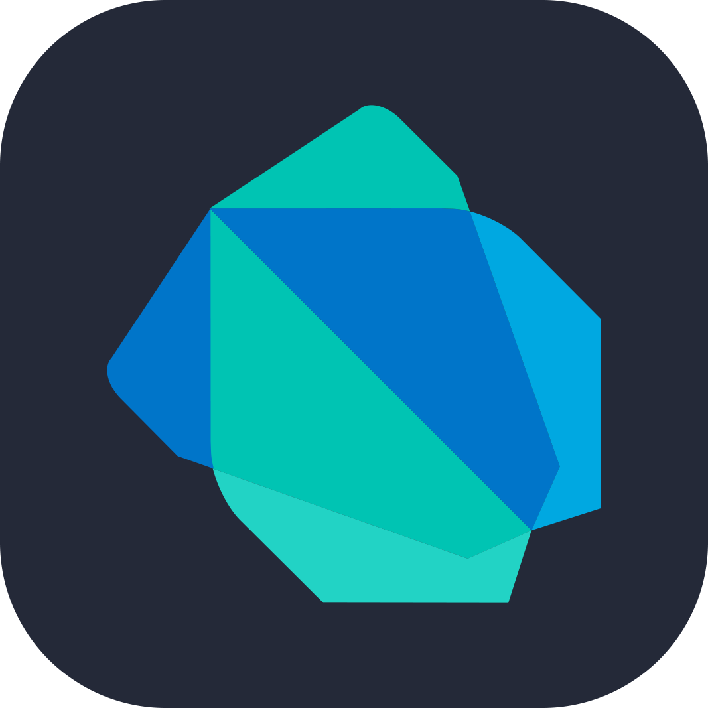
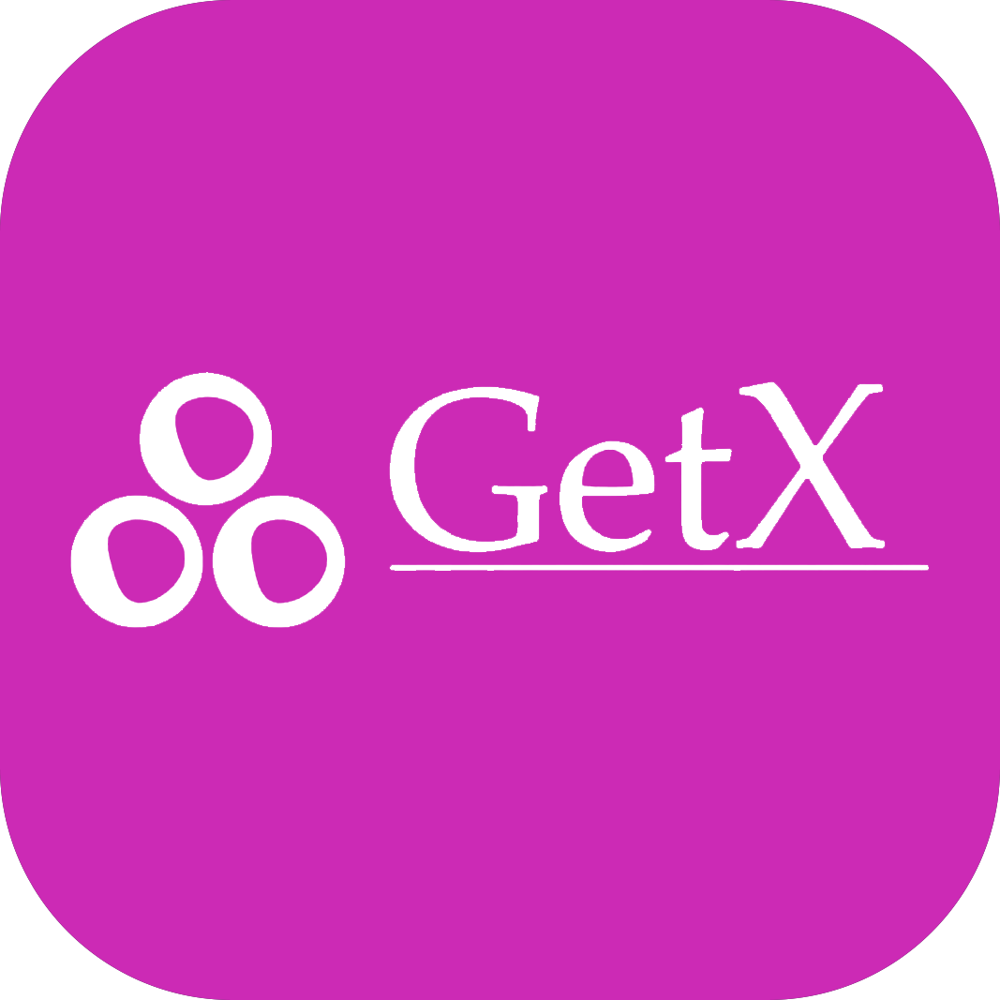

 <!-- ====================================================== This the top header ====================================================== -->
<p align="center">
  
</p>


 <!-- ========================================================= for the name ========================================================= -->
<h1 align="center"> 
   
  I'm Mahmoud Elmahdy
   
</h1>


<!-- ========================================================= for the title ========================================================= -->
<p align="center" style="color:gray;">
  Flutter developer, graphic designer, video editor and a YouTuber
</p>


<!-- ==================================================== for the animation title ==================================================== -->
<p align="center">
  
</p>


<!-- ========================================================== for the bio ========================================================== -->
```yaml
I am a junior Flutter developer passionate about building responsive, user-friendly and beautiful mobile apps.
With a strong foundation in Dart and Flutter, I enjoy solving problems, learning new technologies,   
and collaborating on innovative projects.
Additionally, I have over 5 years of experience in graphic design and video editing, which enhances my ability 
to create  visually appealing and engaging applications.
And Yah.. I'm also a YouTuber
```
<br>

<!-- ========================================================== for the ● info ========================================================== -->
<!--
⚡ Fun fact:
- 👯 I’m looking to collaborate on projects that are using Flutter.
- 👯 I’m looking to collaborate on open source projects.

<br>
-->
  <!-- ====================================================== for github statistics ====================================================== -->
<!--
<div align="center" style="margin: 20px 0;">
  
  
</div>
-->

<!-- ===================================================== for the Languages & Skills ===================================================== -->
### Languages & Skills
<a href="#"></a>&nbsp;
<a href="#"></a>&nbsp;
<a href="#"></a>&nbsp;
<a href="#"></a>&nbsp;
<a href="#"></a>&nbsp;
<a href="#"></a>&nbsp;
<a href="#"></a>&nbsp;
<a href="#"></a>&nbsp;
<a href="#"></a>&nbsp;
<a href="#"></a>&nbsp;

<!-- ======================================================== for the Softwares ======================================================== -->
### Softwares
<a href="#"></a>&nbsp;
<a href="#"></a>&nbsp;
<a href="#"></a>&nbsp;
<a href="#"></a>&nbsp;
<a href="#"></a>&nbsp;
<a href="#"></a>&nbsp;
<a href="#"></a>&nbsp;
<a href="#"></a>&nbsp;
<a href="#"></a>&nbsp;
<a href="#"></a>&nbsp;
<a href="#"></a>&nbsp;
<a href="#"></a>&nbsp;
<a href="#"></a>&nbsp;
<a href="#"></a>&nbsp;

<br>

<!-- ========================================================== for the links ========================================================== -->
📱 Let's Connect:
<p>Feel free to reach out for collaborations or just to say hi!</p>
  
  [](https://youtube.com/MahmoudElmahdy)
  [](https://www.behance.net/Mahmoud_Elmahdy)
  [](https://www.tiktok.com/@m_elmahdy_1)
  [](https://www.facebook.com/Mahmoud.Elmahdy.127)
  [](https://www.instagram.com/m_elmahdy_1)
  [](mailto:elmahdy.contact@gmail.com)
<!--
  [](https://Elmahdyzone.com)
  [](https://www.linkedin.com/in/MahmoudElmahdy1)
  -->
<br>

<!-- ============================================================ for the cv ============================================================ -->
<!--
### Employer?
> [!IMPORTANT]  
> <a href="https://drive.google.com/...." download>Download my resume</a>

-->

<!-- ======================================================== for buy me a coffee ======================================================== -->

☕ Want to support me?
	
Do you find my work to be of a value for you?
You can support me, buy me a **Book**, or a **Coffee**.

[](https://buymeacoffee.com/mahmoudelmahdy)

<br>

<!-- ======================================================= for the bottom header ======================================================= -->
<p align="center">
  
</p>

